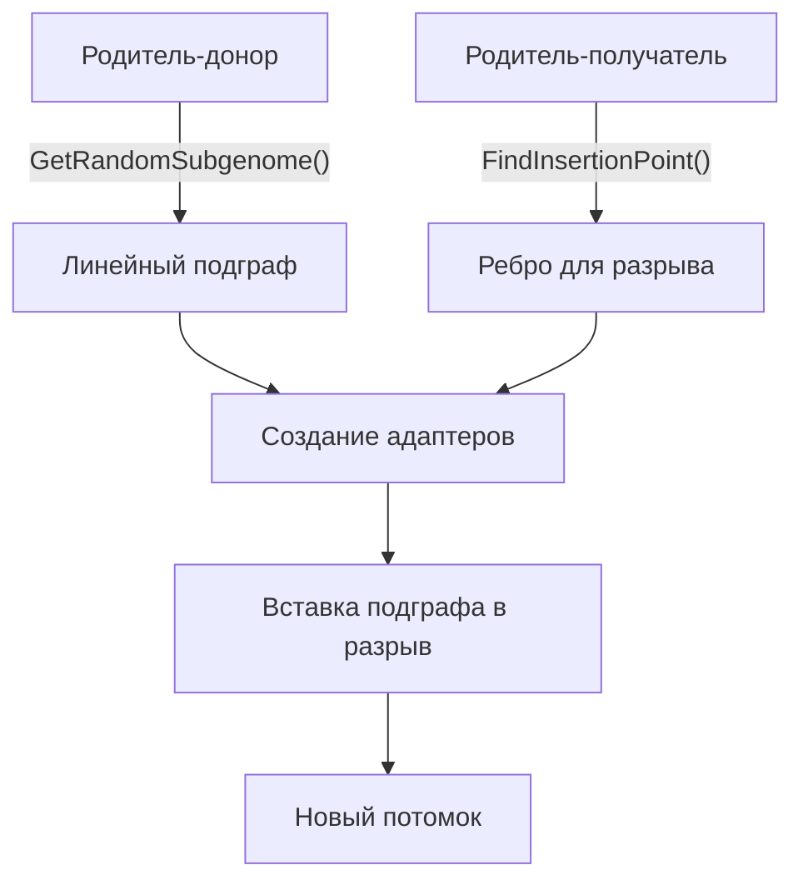
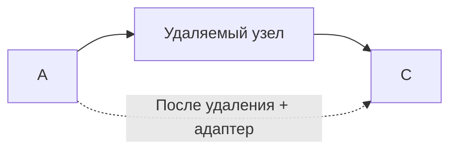
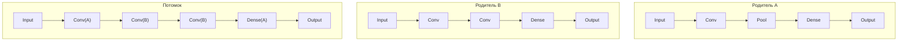
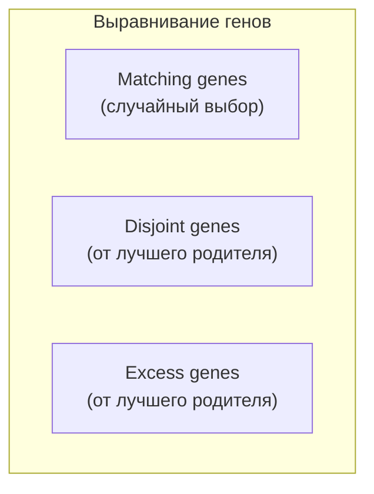
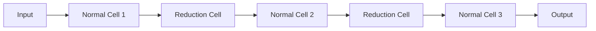
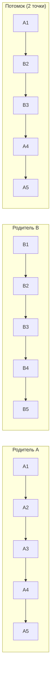

# Улучшения кроссинговера графов нейронных сетей

Документ описывает текущую реализацию скрещивания архитектур нейросетей в проекте, выявленные проблемы и возможные улучшения на основе научных работ по Neural Architecture Search (NAS) и нейроэволюции.

---

## 1. Анализ текущей реализации

### Текущий алгоритм (`Genome.Breed`)



**Шаги:**
1. Из генома-донора извлекается случайный **линейный** подграф (цепочка узлов с 1 входом и 1 выходом)
2. В геноме-получателе ищется ребро, куда подграф можно вставить
3. При несовместимости форм создаются адаптеры (Pooling, Conv 1×1, Flatten, Dense)
4. Граф-получатель клонируется, ребро разрезается, подграф вставляется

### Выявленные проблемы

| # | Проблема | Критичность | Описание |
|---|---------|-------------|----------|
| 1 | **Неконтролируемый рост графа** | 🔴 Критично | Каждое скрещивание только добавляет узлы. Нет механизма удаления, замены или ограничения размера. После N поколений граф разрастается бесконечно (проблема *bloat* из генетического программирования) |
| 2 | **Только линейные подграфы** | 🟡 Важно | `_getRandomSubgenome()` извлекает только узлы с `previous.length === 1 && next.length === 1`. Ветвления, skip-connections и merge-узлы игнорируются |
| 3 | **Адаптеры раздувают граф** | 🟡 Важно | Каждая вставка может добавить 1–3 адаптера, которые сами никогда не удаляются |
| 4 | **Отсутствие структурных мутаций** | 🟡 Важно | Метод `Mutate` в узлах меняет только параметры (units, kernel, activation), но не топологию |
| 5 | **Нет механизма speciation** | 🟢 Улучшение | Все геномы конкурируют друг с другом, что приводит к потере разнообразия |

---

## 2. Контроль роста графа (Bloat Control)

### 2.1 Parsimony Pressure (давление на простоту)

> **Источник:** *K. Stanley & R. Miikkulainen, "Evolving Neural Networks through Augmenting Topologies" (NEAT), 2002*

Добавляется штраф к функции приспособленности (fitness), пропорциональный сложности архитектуры:

```
adjusted_fitness = raw_fitness - α × complexity_metric
```

**Метрики сложности:**
- Количество узлов в графе
- Количество обучаемых параметров (через `GetResources().flash`)
- Суммарное количество MACs (через `GetResources().macs`)
- Количество рёбер (соединений)

**Преимущества:**
- Мягкий контроль: не запрещает рост, а делает его невыгодным
- Позволяет строить сложные архитектуры, если они дают значительный прирост точности

**Реализация:**
```typescript
// В функции фитнеса
const nodeCount = getAllNodes(genome).length;
const totalMacs = getAllNodes(genome).reduce((sum, n) => sum + n.GetResources(4).macs, 0);
const adjustedFitness = accuracy - alpha * nodeCount - beta * (totalMacs / maxMacs);
```

**Рекомендуемые значения α:** 0.001–0.01 (подбирается экспериментально)

---

### 2.2 Жёсткий лимит на количество узлов

> **Источник:** *E. Real et al., "Regularized Evolution for Image Classifier Architecture Search" (AmoebaNet), 2019*

Простейший подход: задать `MAX_NODES` и отклонять мутации/скрещивания, которые превышают лимит.

```typescript
const MAX_NODES = 30;

public Breed(genome: Genome): ... | null {
    const currentNodeCount = this.getAllNodesCount();
    const subgenome = genome.GetRandomSubgenome();
    const adapterCount = /* estimated adapters */;
    
    if (currentNodeCount + subgenome.length + adapterCount > MAX_NODES) {
        return null; // Отклоняем слишком крупных потомков
    }
    // ... existing logic
}
```

**Преимущества:** Простота реализации, гарантированный контроль  
**Недостатки:** Жёсткий порог может быть слишком ограничивающим

---

### 2.3 Удаляющие мутации

> **Источник:** *K. Stanley, "Efficient Evolution of Neural Networks through Complexification", PhD thesis, 2004*

Баланс между добавляющими и удаляющими мутациями:

| Мутация | Вероятность | Описание |
|---------|------------|----------|
| `add_node` | 0.03 | Разрезать случайное ребро, вставить узел |
| `remove_node` | 0.02 | Удалить случайный узел (1 вход, 1 выход), замкнув ребро |
| `add_connection` | 0.05 | Добавить skip-connection |
| `remove_connection` | 0.05 | Удалить случайное ребро |
| `mutate_params` | 0.80 | Мутировать параметры существующих узлов |

**Удаление узла:**


```typescript
public MutateRemoveNode(): void {
    const candidates = this.getAllNodes()
        .filter(n => n.previous.length === 1 && n.next.length === 1);
    
    if (candidates.length === 0) return;
    
    const toRemove = candidates[Math.floor(Math.random() * candidates.length)];
    const prev = toRemove.previous[0];
    const next = toRemove.next[0];
    
    prev.RemoveNext(toRemove);
    
    // Попытка напрямую соединить
    if (prev.CheckCompability(next)) {
        prev.AddNext(next);
    } else {
        // Создаём адаптер
        const adapter = this.createAdapter(prev.GetOutputShape(), next.GetInputShape());
        if (adapter) {
            prev.AddNext(adapter[0]);
            for (let i = 1; i < adapter.length; i++) {
                adapter[i-1].AddNext(adapter[i]);
            }
            adapter[adapter.length - 1].AddNext(next);
        }
    }
}
```

---

### 2.4 Resource-Aware Fitness

Ваша система уже вычисляет `GetResources()` (flash, RAM, MACs) для каждого узла. Это можно использовать для ограничения:

```typescript
const totalResources = nodes.reduce((acc, n) => ({
    flash: acc.flash + n.GetResources(4).flash,
    ram: acc.ram + n.GetResources(4).ram,
    macs: acc.macs + n.GetResources(4).macs,
}), { flash: 0, ram: 0, macs: 0 });

// Multi-objective: Pareto-оптимальность
// Архитектура доминирует другую, если она лучше по ВСЕМ критериям
const fitness = {
    accuracy: trainResult.accuracy,
    efficiency: 1.0 / totalResources.macs,
    size: 1.0 / totalResources.flash,
};
```

> **Источник:** *T. Elsken, J.H. Metzen, F. Hutter, "Efficient Multi-Objective Neural Architecture Search via Lamarckian Evolution", ICLR 2019*

---

## 3. Улучшения механизма скрещивания

### 3.1 Subgraph Replacement (замена вместо вставки)

> **Источник:** *L. Xie & A. Yuille, "Genetic CNN", ICCV 2017*

Вместо **вставки** подграфа между узлами — **замена** существующего подграфа аналогичным:



**Алгоритм:**
1. Извлечь подграф из родителя A (удаляемый сегмент)
2. Извлечь подграф из родителя B (заменяющий сегмент)
3. Заменить подграф A на подграф B (с адаптерами при необходимости)

**Преимущества:**
- Размер графа остаётся **стабильным** (±адаптеры)
- Более разнообразные потомки
- Нет проблемы bloat

```typescript
public BreedByReplacement(donor: Genome): { genome: Genome, nodes: BaseNode[], isValid: boolean } | null {
    // 1. Извлечь подграф из текущего генома (будет заменён)
    const replacedSubgenome = this._getRandomSubgenome();
    if (replacedSubgenome.length === 0) return null;
    
    // 2. Извлечь подграф из донора (будет вставлен вместо)
    const donorSubgenome = donor.GetRandomSubgenome();
    if (donorSubgenome.length === 0) return null;
    
    // 3. Найти точки входа и выхода заменяемого подграфа
    const entryNode = replacedSubgenome[0].previous[0]; // Узел перед заменяемым
    const exitNode = replacedSubgenome[replacedSubgenome.length - 1].next[0]; // Узел после
    
    // 4. Проверить совместимость и создать адаптеры
    const inputAdapter = this.createAdapter(
        entryNode.GetOutputShape(), 
        donorSubgenome[0].GetInputShape()
    );
    const outputAdapter = this.createAdapter(
        donorSubgenome[donorSubgenome.length - 1].GetOutputShape(),
        exitNode.GetInputShape()
    );
    
    // 5. Клонировать граф, удалить старый подграф, вставить новый
    // ...
}
```

---

### 3.2 NEAT-style Crossover (алигнмент по инновационным номерам)

> **Источник:** *K. Stanley & R. Miikkulainen, "Evolving Neural Networks through Augmenting Topologies", ECJ 2002*

Каждому ребру и узлу при создании присваивается глобальный **innovation number**. При скрещивании:



| Gene | Parent A | Parent B | Потомок |
|------|----------|----------|---------|
| 1 | Conv 3×3 | Conv 5×5 | **Случайный выбор** |
| 2 | Pool 2×2 | Pool 2×2 | **Случайный выбор** |
| 3 | Dense 128 | — | **Только если A лучше** |
| 4 | — | Conv 1×1 | **Только если B лучше** |
| 5 | Dense 64 | Dense 256 | **Случайный выбор** |

**Преимущества:**
- Размер потомка ≤ max(размер A, размер B)
- Сохраняет топологические инновации
- Естественная защита от bloat

**Реализация требует:**
- Глобальный счётчик innovation numbers
- Хранение innovation number в каждом узле и ребре
- Comparator для выравнивания двух геномов

```typescript
// Добавить в BaseNode
public innovationNumber: number;
private static globalInnovation = 0;

constructor() {
    this.innovationNumber = BaseNode.globalInnovation++;
    // ...
}
```

---

### 3.3 Cell-Based Crossover (клеточная архитектура)

> **Источник:** *B. Zoph et al., "Learning Transferable Architectures for Scalable Image Recognition" (NASNet), CVPR 2018; H. Liu et al., "DARTS: Differentiable Architecture Search", ICLR 2019*

Архитектура разбивается на повторяющиеся **ячейки** (cells). Скрещивание и мутация происходят на уровне ячеек.



**Типы ячеек:**
- **Normal Cell** — сохраняет пространственную размерность (H×W)
- **Reduction Cell** — уменьшает размерность в 2 раза (stride=2)

**Скрещивание:**
```
Родитель A: [NC_a1] → [RC_a] → [NC_a2] → [RC_a] → [NC_a3]
Родитель B: [NC_b1] → [RC_b] → [NC_b2] → [RC_b] → [NC_b3]
Потомок:    [NC_a1] → [RC_b] → [NC_b2] → [RC_a] → [NC_a3]
```

**Преимущества:**
- Размер строго фиксирован (N ячеек)
- Каждая ячейка — компактный DAG
- Легко масштабировать: больше ячеек = глубже сеть

**Реализация требует:**
- Класс `Cell` как контейнер для подграфа
- Стандартизованный вход/выход ячейки
- Фиксированный macro-skeleton (порядок Normal/Reduction)

---

### 3.4 Multi-Point Crossover

> **Источник:** *E. Real et al., "Large-Scale Evolution of Image Classifiers", ICML 2017*

Вместо одной точки вставки — несколько:



Каждый сегмент между точками разреза случайно берётся от одного из двух родителей.

---

## 4. Структурные мутации (расширение текущего `Mutate`)

### 4.1 Добавление узла (Node Insertion)

Разрезать случайное ребро и вставить новый случайный узел:

```
До:   A → B
После: A → NewConv → B
```

### 4.2 Удаление узла (Node Removal)

Удалить случайный линейный узел и замкнуть ребро:

```
До:   A → X → B
После: A → (adapter?) → B
```

### 4.3 Добавление Skip-Connection

> **Источник:** *K. He et al., "Deep Residual Learning for Image Recognition" (ResNet), CVPR 2016*

Выбрать два узла с совместимыми формами и добавить residual connection через `AddNode`:

```
До:   A → B → C
После: A → B → C
       A -------→ Add → D
                   ↑
                   C ----┘
```

### 4.4 Замена типа узла

Заменить тип операции узла с сохранением совместимости:
- `Conv 3×3 → Conv 5×5`
- `MaxPool → AvgPool`
- `Dense 128 → Dense 256`
- `Conv → DepthwiseSeparableConv` (если поддерживается)

### 4.5 Изменение макро-топологии

Переключение типа соединения между ветвями:
- `Add → Concat` (или наоборот)
- Добавление/удаление параллельной ветви

---

## 5. Speciation (видообразование)

> **Источник:** *K. Stanley & R. Miikkulainen, NEAT, 2002*

Проблема: без видообразования новые топологические инновации немедленно конкурируют с оптимизированными простыми архитектурами и проигрывают, не успев раскрыть потенциал.

**Решение:** Разделить популяцию на **виды** (species) по структурному сходству и проводить конкуренцию **внутри** видов.

### Метрика расстояния между геномами

```
δ = (c1 × E)/N + (c2 × D)/N + c3 × W̄
```

Где:
- `E` — количество excess genes (только в NEAT-style)
- `D` — количество disjoint genes
- `W̄` — среднее различие весов/параметров matching genes
- `N` — размер большего генома
- `c1, c2, c3` — коэффициенты

**Упрощённая метрика для вашей системы (без innovation numbers):**

```typescript
function genomeDistance(a: Genome, b: Genome): number {
    const nodesA = getAllNodes(a);
    const nodesB = getAllNodes(b);
    
    // Различие в размере
    const sizeDiff = Math.abs(nodesA.length - nodesB.length);
    
    // Различие в типах узлов
    const typesA = nodesA.map(n => n.GetNodeType()).sort();
    const typesB = nodesB.map(n => n.GetNodeType()).sort();
    const typeOverlap = countCommonElements(typesA, typesB);
    const typeDiff = Math.max(typesA.length, typesB.length) - typeOverlap;
    
    // Различие в глубине графа
    const depthA = getMaxDepth(a);
    const depthB = getMaxDepth(b);
    const depthDiff = Math.abs(depthA - depthB);
    
    return c1 * sizeDiff + c2 * typeDiff + c3 * depthDiff;
}
```

---

## 6. Продвинутые методы

### 6.1 Tournament Selection с Aging

> **Источник:** *E. Real et al., "Regularized Evolution", 2019*

Вместо удаления худших — удаление **старейших** геномов из популяции. Это предотвращает застревание в локальных оптимумах.

```typescript
// При добавлении нового потомка
population.push({ genome: child, age: 0, fitness: evaluatedFitness });

// При отборе: удаляем самый старый из случайной выборки
const sample = randomSample(population, tournamentSize);
const oldest = sample.reduce((a, b) => a.age > b.age ? a : b);
population.remove(oldest);
```

### 6.2 Weight Inheritance (Ламаркианская эволюция)

> **Источник:** *T. Elsken et al., "Efficient Multi-Objective NAS via Lamarckian Evolution", ICLR 2019*

При клонировании узлов — наследовать обученные веса. Это значительно ускоряет обучение потомков.

### 6.3 Progressive Growing

> **Источник:** *C. Liu et al., "Progressive Neural Architecture Search", ECCV 2018*

Начинать с простых архитектур (1–2 слоя) и постепенно увеличивать сложность:

```
Generation  1-10:  max 5  узлов
Generation 11-20:  max 10 узлов
Generation 21-30:  max 15 узлов
...
```

---

## 7. Рекомендуемый план внедрения

| Фаза | Изменение | Приоритет | Сложность |
|------|-----------|-----------|-----------|
| **Фаза 1** | Жёсткий лимит `MAX_NODES` в `Breed()` | 🔴 | Низкая |
| **Фаза 1** | Мутация удаления узла (`MutateRemoveNode`) | 🔴 | Средняя |
| **Фаза 1** | Parsimony pressure в fitness | 🔴 | Низкая |
| **Фаза 2** | Subgraph Replacement crossover | 🟡 | Средняя |
| **Фаза 2** | Resource-aware multi-objective fitness | 🟡 | Средняя |
| **Фаза 2** | Мутация добавления skip-connection | 🟡 | Средняя |
| **Фаза 3** | NEAT-style innovation numbers + crossover | 🟢 | Высокая |
| **Фаза 3** | Speciation (видообразование) | 🟢 | Высокая |
| **Фаза 3** | Cell-Based архитектура | 🟢 | Высокая |
| **Фаза 4** | Weight Inheritance | 🟢 | Средняя |
| **Фаза 4** | Progressive Growing | 🟢 | Низкая |
| **Фаза 4** | Tournament Selection с Aging | 🟢 | Низкая |

---

## 8. Ссылки

1. **NEAT:** K. Stanley & R. Miikkulainen, *"Evolving Neural Networks through Augmenting Topologies"*, Evolutionary Computation, 2002
2. **AmoebaNet:** E. Real et al., *"Regularized Evolution for Image Classifier Architecture Search"*, AAAI, 2019
3. **Large-Scale Evolution:** E. Real et al., *"Large-Scale Evolution of Image Classifiers"*, ICML, 2017
4. **Genetic CNN:** L. Xie & A. Yuille, *"Genetic CNN"*, ICCV, 2017
5. **NASNet:** B. Zoph et al., *"Learning Transferable Architectures for Scalable Image Recognition"*, CVPR, 2018
6. **DARTS:** H. Liu et al., *"DARTS: Differentiable Architecture Search"*, ICLR, 2019
7. **Lamarckian NAS:** T. Elsken et al., *"Efficient Multi-Objective NAS via Lamarckian Evolution"*, ICLR, 2019
8. **Progressive NAS:** C. Liu et al., *"Progressive Neural Architecture Search"*, ECCV, 2018
9. **ResNet:** K. He et al., *"Deep Residual Learning for Image Recognition"*, CVPR, 2016

---

## 9. Графический компонент: «Менеджер эволюции» (Evolution Manager)

Поскольку `Network-Canvas` выступает в роли песочницы для наблюдения за скрещиванием и мутациями на лету, необходимо реализовать визуальную панель управления эволюционными процессами.

**Расположение:** Компонент рендерится в `SidePanel`, когда активно состояние `menuType === "Genome"`.
**Главная цель:** Позволить пользователю интерактиво тестировать комбинации алгоритмов NAS (Neural Architecture Search), визуально отслеживать их влияние на граф и предотвращать *bloat* (раздувание графов).

### 9.1 Структура интерфейса (UI Layout)

#### Раздел 1. Методы скрещивания (Crossover Strategies)
*Пользователь может выбрать один или несколько чекбоксов. Если выбрано несколько, система случайным образом выбирает метод при каждом вызове `Breed()`.*
- [x] **Subgraph Insertion** (Вставка случайного подграфа — *текущая реализация*)
- [ ] **Subgraph Replacement** (Замена подграфа аналогичного размера/типа для сохранения стабильного размера)
- [ ] **NEAT-style Crossover** (Выравнивание узлов по историческим маркерам)
- [ ] **Multi-point Crossover** (Обмен несколькими сегментами)

#### Раздел 2. Стратегии мутаций (Mutation Strategies)
*Управление вероятностями мутаций с помощью ползунков (от 0% до 100%).*
- **Params Mutation**: `[======----]` 60% *(Уже реализовано на уровне нод)*
- **Add Node**: `[==--------]` 20% *(Разрезание ребра и вставка случайного слоя)*
- **Remove Node**: `[=---------]` 10% *(Удаление промежуточного слоя с соединением его соседей)*
- **Add Skip-Connection**: `[===-------]` 30% *(Внедрение AddNode для обходных связей)*
- **Change Layer Type**: `[=---------]` 10% *(Замена типа логики ноды без изменения топологии)*

#### Раздел 3. Контроль размера и сложности (Bloat Control)
*Модуль для тестирования алгоритмов сдерживания разрастания сети.*
- **Global Node Limit (MAX_NODES)**: `[ Toggle ]` -> Поле ввода: `30`
- **Parsimony Pressure**: `[ Toggle ]` 
  - *Коэффициент (α)*: `Slider [0.001 - 0.1]` (Штраф за избыточные узлы)
- **Resource-Aware Fitness**: `[ Toggle ]` (Ограничения по доступной Flash/RAM, вычисляемые через существующий метод `GetResources()`)

#### Раздел 4. Действия (Actions Playaround)
*Панель ручного триггера алгоритмов на холсте.*
* **Кнопка [Mutate Current]** — Мгновенно применяет выбранные вероятности мутаций к текущему графу на холсте.
* **Кнопка [Breed with Random/Selected]** — Берёт текущий граф и скрещивает его с другим геномом, применяя выбранную стратегию из Раздела 1 и фильтры из Раздела 3. Результат мгновенно отображается на `Network-Canvas`.
* **Блок Метрик** — Отображает информацию "в реальном времени" под кнопками: *Total Nodes: X*, *Estimated Resources: Y kb*, *Penalty Score: Z*.

### 9.2 Архитектурная интеграция с React/Zustand

1. **Глобальный стейт (Zustand)**: Расширить `useCanvasGenomeStore` или создать отдельный `useEvolutionSettingsStore` для хранения стейта ползунков и выбранных алгоритмов (`selectedCrossovers: string[]`, `mutationProbabilities: Record<string, number>`, и тд.).
2. **SidePanel Rendering**: При клике на пустой холст (или по кнопке в тулбаре), `menuType` переключается в `Genome`, и `SidePanel` рендерит компонент `<EvolutionManager />`.
3. **Обратная связь на Canvas**: При нажатии кнопок скрещивания/мутации вызываются экшены Zustand `mutateGraph(settings)` или `breedGraph(targetGenome, settings)`. Canvas должен плавно перерендерить новые узлы и связи (возможно, с подсветкой новых узлов другим цветом на несколько секунд для наглядности).
